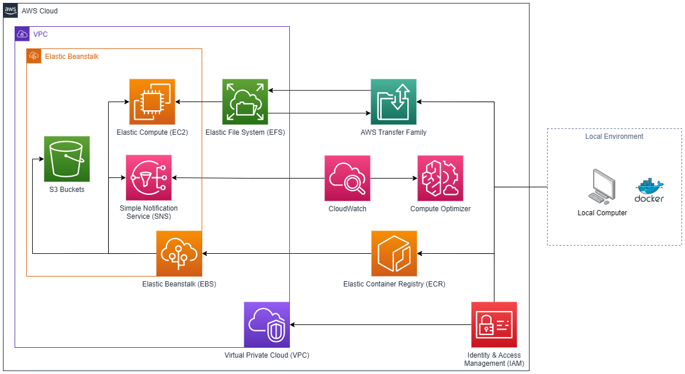

# Information about the AWS deployment since it is a little convoluted...

Here are the key concepts about how the website is structured for deployment:

- The data is too large to be deployed directly with the site, so it must be uploaded to AWS separately.
- AWS is able to build Docker images automatically, but our image uses too much memory due to all of the dependencies to be built on AWS.
- So the site must be built locally and then uploaded to AWS.
- Finally, the site can be deployed using the local configuration files, these orchestrate connecting the data to the image.

## Deployment
Here is all the information about how to deploy an updated version of the site to AWS.
If you want details on the AWS services and configuration, refer to the [AWS Configuration section](#aws-configuration).

### Prerequisites
- You must be logged into the laughneylab AWS account.
- You must install the [AWS CLI](https://aws.amazon.com/cli/) onto your computer and follow the instructions to log in.
- You must have [Docker](https://www.docker.com/) installed and running on your computer.
- Finally, you must install the Elastic Beanstalk CLI:
    - I would recommend installing [pipx](https://pypa.github.io/pipx/) and then using pipx to install the cli (`pipx install awsebcli`).
    - Otherwise, you can directly install it using pip (`pip install awsebcli`).
    - Then you must run the following command to initialize the CLI: `eb init` and make sure you select the `us-east-2` region and the `Contacttracingsite-env` environment.
- If you need to update the data uploaded to the server, you must have an SFTP client. However, I am going to assume the command line sftp cli is available.

Once ready, ensure Docker is running and open a command line terminal in the root of this project directory.

### Updating the Site
After you have made changes to the site, you must build the Docker image locally. This is pretty straightforward.
```bash
docker build --compress --rm -t ct-site .
```
**Note**: If you want to test the site locally through Docker, make sure you have all the data on your computer in the 
`data/` directory, then you can run the following command:
```bash
docker run -v "$(pwd)/data":/app/data -p 8000:8000 ct-site
```
This will run the site locally on port 8000 and link the local data to the image. You can then navigate to http://localhost:8000 to see the site.


Additionally, if any site updates you made effect the default plots shown on the website, you **MUST** recompile these
figures. To do this, you must run the figure scripts with the following commands (assuming the data is available locally and you are still in the project root directory):
```bash 
# If you updated the Circos figure:
PYTHONPATH=. python pages/circos.py
# If you updated the pairwise interactions figure:
PYTHONPATH=. python pages/interactions.py
# If you updated the cascading effects figure:
PYTHONPATH=. python pages/ligand_effects.py
```
Then you **MUST** replace the figures that are uploaded with the other data on AWS. To do this, upload the files that end 
with `.pkl` in the `data/compiled` directory to the corresponding directory on AWS by following the instructions in the 
[data upload section](#uploading-the-data).


Once built successfully, we must upload the image to AWS. We do this by pushing the image to our public ECR
repository. Assuming you are logged into the AWS CLI on the lab account, you need to run the following commands:
```bash 
# Log into the ECR repository
aws ecr-public get-login-password --region us-east-1 | docker login --username AWS --password-stdin public.ecr.aws/d6q7u0s0

# Tag the image with the ECR repository
docker tag ct-site:latest public.ecr.aws/d6q7u0s0/ct-site:latest

# Push the image to the ECR repository
docker push public.ecr.aws/d6q7u0s0/ct-site:latest
```
After being pushed, the image will be available to the Elastic Beanstalk environment. The entire build process can produce
more than 10GB of cached files, so if you wanted to clean up these files you can run the following command to purge
ALL cached Docker data:
```bash 
docker system prune -a
```

Once the image has been pushed to AWS, the site can then be deployed using the Elastic Beanstalk CLI. To do so, simply
run the following command:
```bash
eb deploy --timeout 30
```
And just wait for around 5-10 minutes. Afterward, the site should be updated and you can open the updated site using the following command:
```bash
eb open
```

**Note**: You can follow the progress of the deployment by running the following command (you must set up ssh access on 
the Elastic Beanstalk CLI):
```bash
eb ssh -c "tail -f /var/log/eb-engine.log"
```

### Updating the data
To make changes to the data structure, you can edit the `viz/data.py` file. This file contains the functions that are used
to generate the compiled data files from the raw ContactTracing results files. The functions that are most relevant are:

- `read_circos_file()`/`_compile_circos()`: These read and generate formatted data for the Circos figure, respectively.
- `read_interactions_file()`/`_combine_obs_for_interactions()`: These read and generate formatted data for the pairwise interactions figure, respectively.
- `read_ligand_effect_for()`/`_compile_ligand_effects()`: These read and generate formatted data for the cascading effects figure, respectively.
- `compile_data()`: This function reads the raw data, then calls the above functions to generate the data.

Once updated, you can then run the following command to generate compiled data files (This can >1 day!):
```bash
# Delete the old compiled data files
rm -rf data/compiled

# Generate the new compiled data files
python viz/data.py

# Use the command below instead if you want to run the script in the background:
nohup bash -c "python ./viz/data.py" > data_output.txt & 
```
Note that this generates feather files. These are a compressed data frame format that is fast for `pandas` to read.

Refer to the next section to now upload these files to AWS.

### Uploading the data
The data is too large to be uploaded directly with the site, so it must be uploaded to AWS separately. To do this, make 
sure you have an SFTP client. I am going to use the command line interface for this example.

The data is hosted on AWS EFS (Elastic Filesystem), but this provides no direct way to interact with the data. Therefore,
EFS is linked to AWS Transfer family, which provides an SFTP server for data transfer. This can incur additional costs for
transfers, so it is important to only upload the data when necessary. Additionally, you *must configure AWS Transfer family with your SSH key*.
Otherwise you will be unable to connect to the server. To do this, follow the [AWS User Guide for adding keys](https://docs.aws.amazon.com/transfer/latest/userguide/key-management.html)
to add your public SSH key to a user on the SFTP server. 

**NOTE**: AWS Transfer Family is disabled by default since it charges hourly. Refer to the [section on it below](#aws-transfer-family)
to learn how to enable it temporarily.

Now that the SSH key is added to the server, open a terminal in the project root directory and enter the sftp console:
```bash 
# Ignore any warnings about the host key, and type yes if prompted
# Note that the specific server name will be different everytime a new server is created!
sftp -i s-xxxxxx yyyyy@s-xxxxxx.server.transfer.us-east-2.amazonaws.com
```
You should see the SFTP prompt:
```bash 
sftp> _
```
If you type `ls` you should see the `data` directory:
```bash 
sftp> ls
data
```
Assuming only the content of files have changed, you can update all the files in-place using the following command:
```bash 
sftp> put -r data
```
Note that if the updated dataset has removed certain files, you must delete them from the server manually.
```bash 
# To delete a file:
sftp> rm data/compiled/path.../*
# To delete a directory:
sftp> rmdir data/compiled/path...
```

You can then exit the SFTP console by typing `exit`:
```bash
sftp> exit
```

Now that the data is uploaded, the site should be updated. But you can also restart the site from the Elastic Beanstalk 
dashboard to force it to reload the data.

## AWS Configuration
Below is an abstract overview of how the various AWS services interact with each other:



Below I describe the configuration settings for each of these services.


### Elastic Beanstalk
This service integrates and orchestrates the other AWS services for deploying the site. Most configurations can be performed
on the web dashboard, but some must be done locally. In addition to the extensions described in the other sections below,
there are the following configuration files:

- `.ebextensions/increase-timeout.config`: Increases the timeout for the Elastic Beanstalk deployment.
- `.elasticbeanstalk/config.yml`: Configures the Elastic Beanstalk environment. This file is automatically generated.
- `Dockerrun.aws.json`: This configures how the site is deployed using our Docker images that are hosted on ECR. In addition to specifying the Docker image, it also specifies the port that should be exposed (must be 8000) and it instructs Docker on how to insert the data files to the container by mounting it as a volume.
- `.ebignore`: This file specifies files that should be ignored and not uploaded to the Elastic Beanstalk environment when deploying the site. Since all data files are on EFS and all code is built into the Docker image, it is configured to ignore all files except for the various Elastic Beanstalk configuration files.

Now I will describe the dashboard, assuming that you have selected the `Contacttracingsite-env` environment. 

* Application versions: Displays previously deployed versions of the website. This lets you rollback bad updates. Note that it is only configured to keep the 10 most recent versions.
* Home page: This gives an overview of the environment. Notably, the Actions dropdown on the top right allows for restarting/rebuilding the environment.
* Configuration: This page displays all configuration options for Elastic Beanstalk. Most settings are left as their default values except for:
    - Instances > EC2 security groups: I added the default security group to allow for consistent security policies when the environment is rebuilt.
    - Capacity > Instance Types: This determines which hardware the environment is allowed to run on. You can compare resources and prices with the https://calculator.aws website.
    - Deployment preferences > Command timeout: This was increased to allow for longer deployment times.
    - Email notifications: I added my email to receive notifications about environment health.
    - Network: I assigned a Public IP address
* Logs: This lets you request the log files generated by Elastic Beanstalk for various things. Deployment logs can be found in the `eb-engine.log` file.
* Health: Summary of the health of the environment.
* Monitoring: Dashboard displaying the metrics tracked for the environment. You can also define alarms here (make sure all alarms use the same, existing SNS topic).
* Alarms: Displays all the configured alarms for the environment.
* Managed updates: Displays the status of Elastic Beanstalk automated updates.
* Events: Lists all events recorded by Elastic Beanstalk on the environment.
* Tags: Meta information for the environment.

### AWS Transfer Family
This service manages a SFTP server that is linked to the EFS service so that we may upload data to the server. 
**WARNING**: This service is relatively expensive! Only upload data when necessary!

To enable the service, navigate to the AWS Transfer Family dashboard, click `Create server`. Then select the following options for each step:

1. Choose Protocols: `SFTP`
2. Choose an identity provider: `Service Managed`
3. Choose an endpoint: `Publically accessible`, Custom hostname: `None`
4. Choose a domain: `Amazon EFS`
5. Configure additional details:
    - Logging Role: `Choose an existing role > AWSTransferLoggingAccess`
    - Security Policy: Leave the default value
    - Server Host Key: You can ignore this
    - Tags: Ignore this
    - Managed workflows: Ignore this
    - Display banners: Ignore this
    - Additional Configuration: Leave the default options
6. Create Server: Click `Create server`, then follow the next few steps to create a user account to log in with:
7. Navigate to the `Users` menu, click `Add user`. Then enter the following options:
    - Username: Enter any username you want to use.
    - User ID: `0`
    - Group ID: `0`
    - Secondary Group IDs: Can be ignored
    - Role: `aws-elasticbeanstalk-ec2-role`
    - Home directory: `contacttracing_site_fs`, leave the optional folder below this option *BLANK*.
    - SSH public keys: Enter your public SSH key here. You can generate one by running `ssh-keygen` in the terminal or read your current run using: `cat ~/.ssh/id_rsa.pub`
8. You can now log into the SFTP server by running the command in the form (replace the `s-xxxxxx` and `yyyyy` with the server name and your selected username):
```bash
sftp -i s-xxxxxx yyyyy@s-xxxxxx.server.transfer.us-east-2.amazonaws.com
```
9. Once you have uploaded data, make sure to delete the server by navigating to the `Servers` menu and clicking `Delete` on the server. This will prevent you from incurring additional costs.

Access to the SFTP server is provided through the managed server account. In order
to give yourself access to the SFTP server, you must create a user and add your public SSH key by accessing the AWS Transfer Family
dashboard and navigating to the User Settings menu for the SFTP server. 

**WARNING**: The SFTP server charges hourly even when not in use! So it should be __deleted__ (not terminated) when not in use!

### EFS 
This service stores the data files used by the site. EFS acts as a virtual file system that can be mounted to any
AWS service. The data is stored in the `contacttracing_site_fs` file system, it contains the `data/` directory which
includes configurations, data, and precompiled figures. There is no direct interface to EFS, so the data must be accessed
through the `AWS Transfer family` service. **WARNING**: Disk space is not statically defined, EFS automatically resizes
according to the required data usage; so only upload the data when necessary! Typically the cost is fairly cheap to store,
but the cost of uploading the data can be pricey. Notable settings for this service include:

- Automatic backups: This is disabled since we can regenerate the data at any point.
- Lifecycle management: This is configured to automatically transfer data to "infrequent access" mode if it has not been accessed within 14 days to save money.
- Performance settings: This is set to "Bursting" to scale according to usage.


**Note**: The data is not automatically attached to the server. The data is instead mounted by using the following custom
scripts for Elastic Beanstalk:

- `.ebextensions/env_var.config`: This specifies the instructions for mounting the EFS file system to the server.
- `.ebextensions/show_efs_inside_app_dir.config`: This specifies the actions Elastic Beanstalk must take to finalized the EFS mounting
- `.platform/hooks/predeploy/mount-efs.sh`: This script is run before the site is deployed, and it does the heavy lifting of actually mounting the EFS to the server instance.


### SNS
This service manages alerts emitted by either Elastic Beanstalk or CloudWatch. Most notably, resource usage alarms and
Elastic Beanstalk deployment progress messages are emitted as alerts. All alerts for the site are routed
through the `ElasticBeanstalkNotifications-Environment-Contacttracingsite-env` "Topic". To add users to the alerts,
simple select that topic from the SNS dashboard and click "Create subscription", then add the email address of the user.
**NOTE**: The user must confirm their subscription!


### EC2
This service manages the actual server instance that hosts the site. This service is managed by Elastic Beanstalk,
so you should not need to interact with it directly. However, accessing EC2 directly can be useful so that you can SSH
into the server instance from the dashboard. You can do this by accessing the EC2 dashboard and navigating to the
"Instances" menu. Then click on the instance and click "Connect" to access the instance.

**WARNING**: Do not manually configure settings here. As it can break the Elastic Beanstalk configuration!

### S3 Buckets
This service stores some static configuration files for Elastic Beanstalk. You should ignore this as it is entirely
managed by Elastic Beanstalk.


### CloudWatch
This service monitors the health and other metrics of the Elastic Beanstalk environment. **WARNING**: This service is 
"freemium", we get 10 free alarms and 10 free metrics. If we exceed this limit, we will be charged for the additional
alarms and metrics. Therefore, be careful about adding additional monitoring!

By default, CloudWatch monitors very basic health metrics for the Elastic Beanstalk environment. However, this excludes
memory usage, so it was added manually. This was added by installing the CloudWatch agent and configuring it to monitor
memory using the following Elastic Beanstalk extension file: `.ebextensions/memory_monitor.cfg`. 

CloudWatch additionally manages the custom resource alarms for the site, but they should not be manually modified. Instead,
the alarms are managed by the Elastic Beanstalk dashboard.


### VPC
This service defines a private network that allows for AWS services to communicate with each other. This is required for
Elastic Beanstalk to orchestrate various services and for Elastic Filesystem to be accessible by the Elastic Beanstalk. The
VPC used by these services is the default VPC for the shared lab account. In addition to managing firewalls, this also allocates
our static IP address for the site.

The IP for the site is 3.135.138.255 and is listed under "Elastic IP addresses".

Additionally, the VPC has a security group configured to allow for EFS access within services inside the VPC like Elastic Beanstalk.
Note that the security group labeled `Contacttracingsite-env` is managed entirely by Elastic Beanstalk and should not be manually
modified. Instead, rules manually added to allow for EFS access was placed in the default security group. The following rules were added:

- Under `Inbound rules`: NFS, port 2049, Any IPv4
- Under `Outbound rules`: NFS, port 2049, Any IPv4

## AWS Compute Optimizer
This service monitors all other AWS services and provides recommendations for cost savings.

### ECR
This service is used to host Docker images. We use the `ct-site` repository (public.ecr.aws/d6q7u0s0/ct-site) to deploy
our images. Notably, this repository is public so that we can get higher free tier limits. The image hosted only contains
code for the website and no credentials or data files. *WARNING*: Never push any credentials or data files to this repository!

Currently there is no way to automatically delete old images, so you might want to occasionally delete images that are not
tagged as `latest` from the ECR repository. You can do this by navigating to the ECR web dashboard.

### IAM
This is the service that AWS uses to manage user permissions for configuring AWS services. Currently I am only using the shared
lab account, so there isn't anything fancy going on here. While most permissions were auto-generated by AWS, I did have
to make some manual adjustments to allow for Elastic Beanstalk to access the EFS files I uploaded. Notably:

* `aws-elasticbeanstalk-ec2-role`: This is used by Elastic Beanstalk to manage the EC2 server instances. The following policies were added:
    - `CloudWatchAgentServerPolices`: Used to allow for the EC2 to send memory usage metrics to CloudWatch (since it doesn't by default).
    - `AmazonElasticFileSystemClientFullAccess`: Used to allow for the EC2 to access the EFS files.
    - `AWSTransferFullAccess`: Used to allow for the SFTP server to access the EFS files.
    - `InstanceStats`: This is a custom policy that allows for full access to Elastic Beanstalk statistics.
